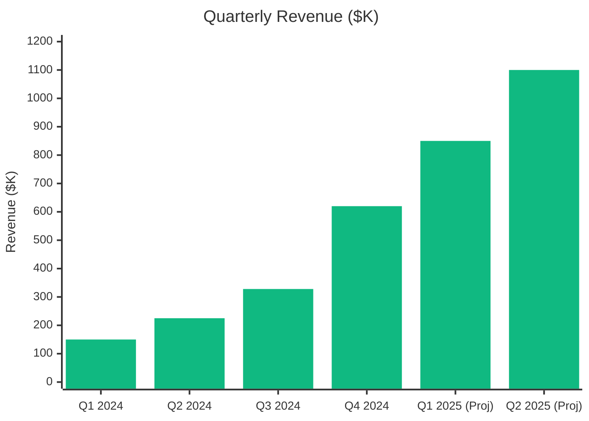
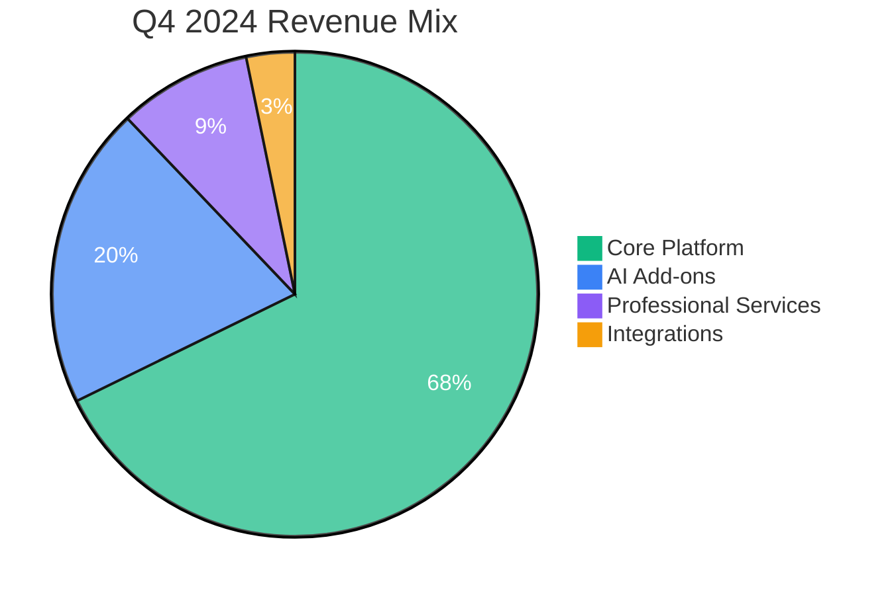
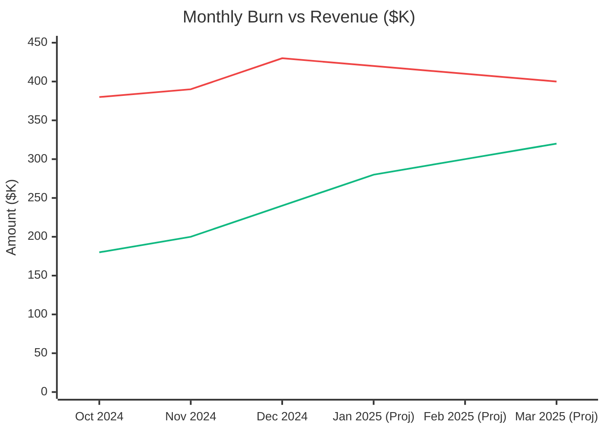

# 💰 Financial Statements

  

    📈
    Strong Financial Performance & Growth
  

  

    Comprehensive financial overview showcasing our path to profitability, strong unit economics, and sustainable growth across all revenue segments.
  

## 📊 Q4 2024 Income Statement

  
### P&L Summary (Q4 2024)

| Line Item | Amount | QoQ Change | Status |
|-----------|--------|------------|--------|
| **Quarterly Revenue** | $620K | +89% | Strong growth |
| **Operating Expenses** | $1.2M | +45% | Scaling investment |
| **Net Income** | -$580K | Improving vs Q3 | Path to profitability |

## 📈 Revenue Breakdown

### 🚀 Quarterly Revenue Growth

### 🎯 Revenue by Customer Segment

| Segment | Q4 2024 | Q3 2024 | Growth |
|---------|---------|---------|--------|
| **🏢 Enterprise** | $310K (50%) | $180K (55%) | +72% |
| **🏪 Mid-Market** | $220K (35%) | $105K (32%) | +110% |
| **🏬 SMB** | $90K (15%) | $43K (13%) | +109% |
| **📊 Total** | **$620K** | **$328K** | **+89%** |

### Revenue by Product Line

## Operating Expenses

### Expense Breakdown (Q4 2024)

| Category | Amount | % of Revenue | QoQ Change |
|----------|--------|--------------|------------|
| **Personnel** | $720K | 116% | +52% |
| **Sales & Marketing** | $280K | 45% | +85% |
| **Technology** | $95K | 15% | +25% |
| **General & Admin** | $105K | 17% | +18% |
| **Total OpEx** | $1,200K | 194% | +45% |

### Monthly Burn Rate Trend

## Unit Economics

### Customer Lifetime Value (LTV)

#### Enterprise Segment
- **LTV**: $45K
- **LTV/CAC Ratio**: 5.3x
- Strong value proposition for large customers

#### Mid-Market Segment  
- **LTV**: $18K
- **LTV/CAC Ratio**: 6.4x
- Excellent efficiency metrics

#### SMB Segment
- **LTV**: $3.2K  
- **LTV/CAC Ratio**: 7.1x
- Highest efficiency with lower acquisition costs

### Gross Margin Analysis

| Metric | Q4 2024 | Q3 2024 | Target |
|--------|---------|---------|---------|
| **Gross Revenue** | $620K | $328K | - |
| **COGS** | $85K | $52K | - |
| **Gross Profit** | $535K | $276K | - |
| **Gross Margin** | 86% | 84% | >85% |

## Cash Flow & Runway

### Cash Position

| Metric | Value | Details | Status |
|--------|-------|---------|--------|
| **Cash Balance** | $18.5M | As of Dec 31, 2024 | Strong position |
| **Series A Funding** | $12M | Closed in December 2024 | Recently raised |
| **Runway** | 47 months | At current burn rate | Excellent runway |

### Cash Flow Statement (Q4 2024)

| Item | Amount |
|------|--------|
| **Operating Cash Flow** | -$580K |
| **Investing Cash Flow** | -$45K |
| **Financing Cash Flow** | +$12.2M |
| **Net Change in Cash** | +$11.6M |
| **Beginning Cash** | $6.9M |
| **Ending Cash** | $18.5M |

## Projections

### 2025 Financial Outlook

```mermaid
%%{init: {
  'theme': 'base',
  'themeVariables': {
    'xyChart': {
      'backgroundColor': 'transparent',
      'titleColor': '#333',
      'xAxisLabelColor': '#333',
      'xAxisTitleColor': '#333',
      'xAxisTickColor': '#333',
      'xAxisLineColor': '#333',
      'yAxisLabelColor': '#333',
      'yAxisTitleColor': '#333',
      'yAxisTickColor': '#333',
      'yAxisLineColor': '#333',
      'plotColorPalette': '#10b981,#ef4444'
    }
  }
}}%%
xychart-beta
    title "2025 Revenue vs Expenses Projection ($K)"
    x-axis ["Q1", "Q2", "Q3", "Q4"]
    y-axis "Amount ($K)" 0 --> 2000
    bar [850, 1100, 1400, 1800]
    bar [1400, 1500, 1600, 1700]
```

### Key Financial Targets (2025)

- **Annual Revenue**: $5.2M (+739% vs 2024)
- **Gross Margin**: 88%
- **Operating Margin**: -15% (path to profitability in 2026)
- **Net Revenue Retention**: 110%
- **Cash Efficiency**: 18 months to break-even

---

*Last updated: December 15, 2024 | Next update: March 15, 2025*