# Market Size & Opportunity

## Market Overview Visualization

 

## Regional Market Distribution 2025

 

 

## Key Market Segments 2025

 

 

## Growth Trajectory 2024-2030

 

 

## Technology Adoption Curve

 

 

## Market Growth Phases

```mermaid
---
title: "Technology Adoption Timeline"
---
graph LR
    A["🚀<br/>Early Adopters<br/>2024<br/>2% Market"] 
    B["📈<br/>Fast Followers<br/>2025<br/>13% Market"]
    C["🎯<br/>Early Majority<br/>2026<br/>34% Market"]
    D["📊<br/>Late Majority<br/>2027<br/>68% Market"]
    E["🌐<br/>Mass Market<br/>2028-2030<br/>84% Market"]
    
    A --> B
    B --> C
    C --> D
    D --> E
    
    style A fill:#1976d2,stroke:#0d47a1,stroke-width:2px,color:#fff
    style B fill:#388e3c,stroke:#1b5e20,stroke-width:2px,color:#fff
    style C fill:#f57c00,stroke:#e65100,stroke-width:2px,color:#fff
    style D fill:#7b1fa2,stroke:#4a148c,stroke-width:2px,color:#fff
    style E fill:#d32f2f,stroke:#b71c1c,stroke-width:2px,color:#fff
```

 

 

## TAM, SAM, and SOM Value in B2B Marketing for 2025 and 2030

B2B marketing faces an accelerated growth landscape, driven by digital transformation, artificial intelligence, and hyper-personalization. To understand its potential, it's essential to analyze the **Total Addressable Market (TAM)**, **Serviceable Addressable Market (SAM)**, and **Serviceable Obtainable Market (SOM)**.

## TAM: The Global B2B Marketing Opportunity

### 2025: $150-300 Billion
The **B2B marketing-specific TAM** is estimated between **1% and 2% of B2B digital commerce**, equivalent to:
- **Estimated range**: $150,000 - $300,000 million USD
- **Calculation base**: Global advertising and marketing spend of $1.8 trillion
- **Key components**: Automation, predictive analytics, multichannel campaigns

### 2030: $25 Trillion in B2B Digital Commerce
- **B2B digital commerce projection**: $25 trillion
- **Includes**: Business-to-business transactions, procurement platforms, supply chain solutions
- **Marketing's role**: Critical in customer acquisition and retention

## SAM: Strategic Segmentation to Maximize Impact

### 2025: Key Addressable Markets

**1. Automation and AI Platforms**
- Projected investment: **$10,110 million** in MarTech
- Market leaders: HubSpot, Marketo
- Annual growth: 28% CAGR in AI segment

**2. B2B Digital Advertising**
- U.S. spending: **$37,680 million** in 2024
- Annual growth: 7.7%
- Main channels: LinkedIn, Google Ads, data-driven campaigns

**3. Qualified Lead Generation**
- Projected market: **$20,000 million**
- Key tools: LinkedIn Sales Navigator, AI-powered chatbots
- Focus: Lead nurturing and conversion

### 2030: SAM Expansion
- **Cross-border B2B payments**: $56.1 trillion
- **European B2B eCommerce GMV**: $1,817 trillion
- **Focus**: Business Process Automation (BPA)
- **Differentiators**: Localization and multilingual support

## SOM: Achievable Market Share

### 2025: Real Participation by Segment

**Automation Platforms**
- Estimated SOM: **$1,500 - $2,000 million**
- SAM participation: 5-10%
- Competitive advantage: CRM integration and analytics tools

**Content Marketing Agencies**
- Global influencer marketing budget: **$32,550 million**
- Captured SOM: **$800 million**
- Specialization: Technical content and B2B case studies

**ABM Solutions (Account-Based Marketing)**
- Represents **15% of B2B marketing spend**
- Projected SOM: **$300 million**
- Strategy: Hyper-personalized campaigns

### 2030: Convergence with Autonomous AI
- **Potential SAM capture**: Up to 12%
- **Monetary equivalent**: ~$6 trillion in digital commerce
- **Enablers**: Generative AI, smart contracts, automated payments
- **Machine-to-machine commerce**: Will redefine success metrics

## Key Growth Factors

### Main Drivers

1. **AI-Powered Hyper-personalization**
   - 73% of B2B buyers demand B2C-like personalized experiences
   - Massive investments in dynamic segmentation

2. **Predictive Analytics**
   - 30% reduction in acquisition costs
   - Leading platforms: Google Analytics 4, Tableau
   - Real-time ROI optimization

3. **B2B Marketplace Expansion**
   - Amazon Business GMV: **$83,100 million** in 2025
   - Opportunities in visibility and certified reviews

### Critical Challenges

1. **Digital Channel Saturation**
   - LinkedIn cost per click increased 22% in 2024
   - Need for innovation: interactive webinars, augmented reality

2. **Privacy Regulations**
   - 40% of retargeting strategies impacted
   - Forced migration to first-party data

3. **Talent Gap**
   - 68% of companies struggle to hire AI specialists
   - Slowdown in advanced technology implementation

## Regional Projections

### North America
**2025**
- Dominance of **45% of global SAM**
- B2B advertising spend: **$19,220 million**
- Emphasis: SaaS and advanced manufacturing

**2030**
- Blockchain smart contracts: 25% of procurement
- Market valued at **$7 trillion**

### Europe
**2025**
- B2B eCommerce GMV: **$1,672 trillion**
- Leaders: Germany and France in industrial solutions

**2030**
- Circular economy will drive 15% of SOM
- Key sectors: Renewable energy, reverse logistics

### Asia-Pacific
**2025**
- India and Vietnam: 18% annual growth
- Focus: Manufacturing SMEs

**2030**
- Alibaba Business will capture 60% of regional SOM
- Integration of financing and omnichannel logistics

## Market Trends

### Technology Trends
- **Conversational AI**: 340% growth in adoption
- **No-code/Low-code**: 65% of sales ops teams adopting
- **Real-time Analytics**: 78% demand instant insights
- **Mobile-first**: 82% of sales reps primarily use mobile
- **AI Content Generation**: 67% of B2B marketers using AI for content creation
- **Voice Search Optimization**: 58% of B2B queries will be voice-based by 2025

### Buyer Behavior Trends
- **Self-service**: 67% prefer self-service options
- **Quick Response**: 90% expect response in less than 1 hour
- **Personalization**: 84% expect personalized experiences
- **Multi-channel**: 73% use 3+ communication channels
- **Video Content**: 70% of B2B buyers watch videos throughout their buyer's journey
- **Social Proof**: 92% of B2B buyers more likely to purchase after reading trusted reviews

### Emerging Market Trends
- **Sustainability Marketing**: 78% of B2B buyers consider environmental impact
- **Blockchain Adoption**: 25% of B2B transactions will use blockchain by 2030
- **Virtual Reality**: 45% of B2B companies will use VR for product demos by 2025
- **Intent Data**: 62% of B2B marketers will leverage intent data for targeting
- **Community-Led Growth**: 40% of B2B companies investing in community platforms
- **Micro-Moments**: 87% of B2B decisions influenced by micro-moments

## Key Projections Summary

| Metric | 2025 | 2030 |
|---------|------|------|
| **Global TAM** | $150,000 - $300,000 million | $25 trillion (B2B digital commerce) |
| **SAM - Automation & AI** | $10,110 million | - |
| **SAM - B2B Digital Advertising (U.S.)** | $37,680 million | - |
| **SAM - Lead Generation** | $20,000 million | $56.1 trillion (cross-border payments) |
| **SOM - Automation Platforms** | $1,500 - $2,000 million | ~$6 trillion (12% of SAM) |
| **SOM - Content Marketing** | $800 million | - |
| **SOM - ABM** | $300 million | - |

## Conclusion: Strategic Routes to Capture Value

B2B marketing is evolving into an ecosystem dominated by data, automation, and interconnected experiences. By 2025, companies prioritizing **AI-powered ABM**, **dynamic TAM/SAM analysis**, and **sales-marketing collaboration** will capture up to **200% more SOM** than traditional competitors.

Toward 2030, the fusion of **commercial IoT** and **self-executing contracts** will redefine success metrics, where SOM will depend on the ability to operate in M2M (machine-to-machine) environments with minimal human intervention.

This landscape demands constant reinvention, where agility to adapt to emerging regulations and generational preferences (especially Millennial and Gen-Z buyers) will determine survival in the B2B marketing market.

## Sources and References

1. Marketing B2B Blog - B2B Marketing Trends 2025
2. LinkedIn - B2B Marketing 2025 and Beyond: 7 Trends
3. JustLeadz - B2B Lead Generation Strategies 2025
4. Convival - TAM, SAM, SOM Whitepaper
5. B2B Marketing World - B2B Marketing Statistics
6. Merkle - B2B Futures Report
7. Demandify Media - Calculating Market Size Using TAM, SAM, and SOM
8. Sopro - B2B Market Segmentation Guide
9. Business Research Insights - B2B Marketing Spending Market Report
10. LinkedIn - B2B Marketing Strategies 2025
11. DBS Website - B2B Marketing Statistics and Trends
12. Absalon Treviño - TAM, SAM, SOM Model for Entrepreneurship
13. Sellers Commerce - B2B Marketing Statistics
14. Data Insights Market - B2B Digital Marketing Report
15. Letterdrop - Total Addressable Market Guide
16. Globe Newswire - Global B2B E-Commerce Market Report 2030
17. Cognism - B2B Marketing Predictions
18. OpenPR - B2B Market Size, Trends and Forecast
19. Intercom - Navigating TAM, SAM, and SOM for B2B Success
20. Spot On Vision - B2B Marketing in 2025
21. Capterra - SAM Software Analysis
22. Marketing Profs - B2B Marketing Changes and Future Trends
23. Grand View Research - B2B E-Commerce Market Analysis
24. Weber Shandwick - Future of B2B Marketing 2030
25. LinkedIn - Future of B2B Marketing 2025 Trends and Strategies
26. Gust de Backer - TAM, SAM, SOM Market Analysis
27. LinkedIn - B2B Marketing Trends (Spanish)
28. LinkedIn - Comprehensive Guide to Determine Market Size
29. Atak Interactive - B2B Marketing Agency of 2030
30. YouTube - Market Sizing Video Content 