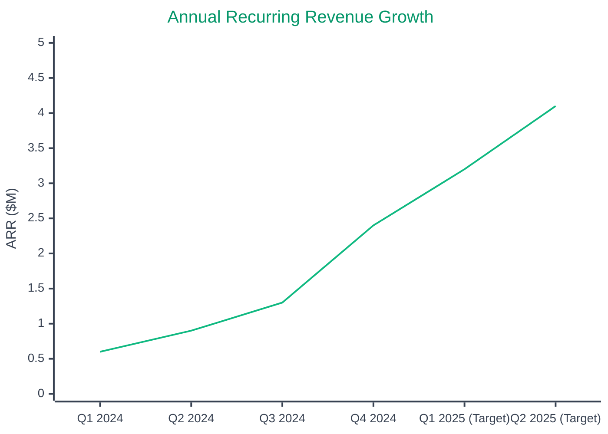

# 🎯 North Star Metric

  

    ⭐
    Our Primary Success Indicator
  

  

    Annual Recurring Revenue (ARR) is our North Star metric, representing the predictable revenue that drives our business decisions and growth strategy.
  

## 📈 Annual Recurring Revenue

### 💰 Current Performance Metrics

#### Primary ARR Metric
- **Current ARR**: $2.4M
- **Reporting Date**: As of December 31, 2024
- **Milestone Status**: Record high achievement

#### Growth Performance

##### Year-over-Year Growth
- **YoY Growth**: 320%
- **Performance**: Exceptional growth trajectory
- **Benchmark**: Industry-leading performance

##### Quarter-over-Quarter Growth  
- **QoQ Growth**: 85%
- **Performance**: Strong quarterly acceleration
- **Trend**: Consistent upward momentum

##### Net Revenue Retention
- **Current NRR**: 94%
- **Performance**: Strong retention with expansion
- **Target**: 110% by Q2 2025

## 📈 ARR Growth Visualization

### ARR Milestones

| Quarter | ARR | QoQ Growth | YoY Growth | Key Drivers |
|---------|-----|-----------|------------|-------------|
| **Q1 2024** | $0.6M | - | - | Initial customer base |
| **Q2 2024** | $0.9M | +50% | - | Product-market fit |
| **Q3 2024** | $1.3M | +44% | - | Sales optimization |
| **Q4 2024** | $2.4M | +85% | +320% | Enterprise growth |
| **Q1 2025** | $3.2M* | +33% | +433% | HubSpot integration |
| **Q2 2025** | $4.1M* | +28% | +356% | European expansion |

*Projected values

## 📊 Growth Trajectory

  

    

      
📈

      <h3 className="nx-text-xl nx-font-bold nx-text-gray-900 dark:nx-text-gray-100">Historical Performance</h3>
    

    

      

        

          
Q3 2024

          
Baseline quarter

        

        

          
$1.3M

          
Starting point

        

      

      

        

          
Q4 2024

          
Record quarter

        

        

          
$2.4M

          

            ↗️
            +85% growth
          

        

      

    

  

  

    

      
🎯

      <h3 className="nx-text-xl nx-font-bold nx-text-gray-900 dark:nx-text-gray-100">Future Targets</h3>
    

    

      

        

          
Q1 2025

          
Next milestone

        

        

          
$3.2M

          

            🎯
            +33% target
          

        

      

      

        

          
End of 2025

          
Annual target

        

        

          
$15M

          
Path to Series B

        

      

    

  

## 🔍 Why ARR is Our North Star

  

    

      

        📊
      

      <h4 className="nx-text-lg nx-font-bold nx-text-gray-900 dark:nx-text-gray-100 nx-mb-2">Predictable Revenue</h4>
      

        ARR provides visibility into recurring revenue streams and enables accurate forecasting for business planning.
      

    

  

  

    

      

        🚀
      

      <h4 className="nx-text-lg nx-font-bold nx-text-gray-900 dark:nx-text-gray-100 nx-mb-2">Growth Indicator</h4>
      

        Direct correlation with customer success, product-market fit, and our ability to scale sustainably.
      

    

  

  

    

      

        💡
      

      <h4 className="nx-text-lg nx-font-bold nx-text-gray-900 dark:nx-text-gray-100 nx-mb-2">Strategic Alignment</h4>
      

        Unifies team focus across product, sales, and customer success towards sustainable recurring revenue growth.
      

    

  

---

  

    <strong>Last updated:</strong> December 15, 2024 | 
    <strong>Next review:</strong> January 15, 2025 | 
    <strong>Data source:</strong> Financial systems & customer billing
  

