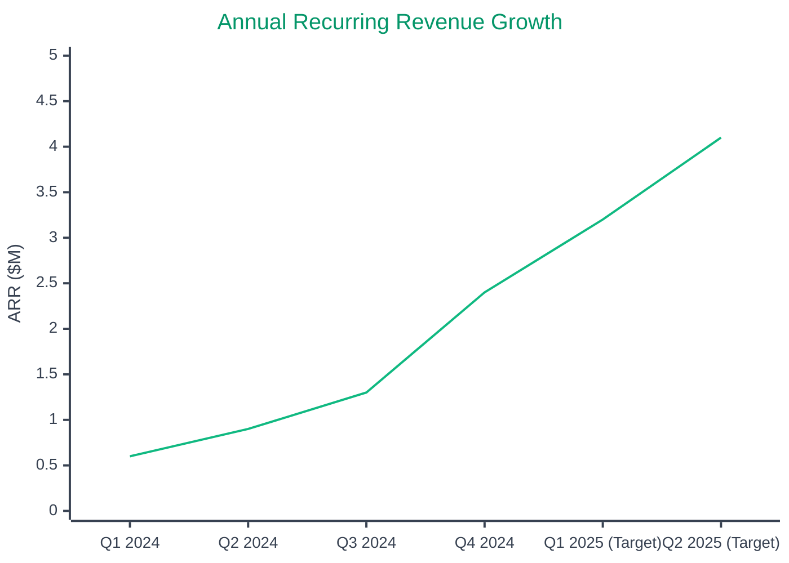

# 🎯 North Star Metric

  

    ⭐
    Our Primary Success Indicator
  

  

    Annual Recurring Revenue (ARR) is our North Star metric, representing the predictable revenue that drives our business decisions and growth strategy.
  

## 📈 Annual Recurring Revenue

### 💰 Current Performance Metrics

#### Primary ARR Metric
- **Current ARR**: $2.4M
- **Reporting Date**: As of December 31, 2024
- **Milestone Status**: Record high achievement

#### Growth Performance

##### Year-over-Year Growth
- **YoY Growth**: 320%
- **Performance**: Exceptional growth trajectory
- **Benchmark**: Industry-leading performance

##### Quarter-over-Quarter Growth  
- **QoQ Growth**: 85%
- **Performance**: Strong quarterly acceleration
- **Trend**: Consistent upward momentum

##### Net Revenue Retention
- **Current NRR**: 94%
- **Performance**: Strong retention with expansion
- **Target**: 110% by Q2 2025

## 📈 ARR Growth Visualization

### ARR Milestones

| Quarter | ARR | QoQ Growth | YoY Growth | Key Drivers |
|---------|-----|-----------|------------|-------------|
| **Q1 2024** | $0.6M | - | - | Initial customer base |
| **Q2 2024** | $0.9M | +50% | - | Product-market fit |
| **Q3 2024** | $1.3M | +44% | - | Sales optimization |
| **Q4 2024** | $2.4M | +85% | +320% | Enterprise growth |
| **Q1 2025** | $3.2M* | +33% | +433% | HubSpot integration |
| **Q2 2025** | $4.1M* | +28% | +356% | European expansion |

*Projected values

## 📊 Growth Trajectory

### 📈 Historical Performance

#### Q3 2024 - Baseline Quarter
- **ARR**: $1.3M
- **Status**: Starting point for growth acceleration
- **Context**: Foundation quarter establishing baseline metrics

#### Q4 2024 - Record Quarter
- **ARR**: $2.4M
- **Growth**: ↗️ +85% QoQ growth
- **Achievement**: Record-breaking performance quarter

### 🎯 Future Targets

#### Q1 2025 - Next Milestone
- **Target ARR**: $3.2M
- **Growth Goal**: 🎯 +33% target growth
- **Timeline**: Next milestone achievement

#### End of 2025 - Annual Target
- **Target ARR**: $15M
- **Strategic Goal**: Path to Series B funding
- **Vision**: Major growth milestone for next funding round

## 🔍 Why ARR is Our North Star

### 📊 Predictable Revenue
- **Visibility**: ARR provides clear insight into recurring revenue streams
- **Forecasting**: Enables accurate business planning and financial projections
- **Stability**: Creates predictable foundation for strategic decision-making

### 🚀 Growth Indicator
- **Customer Success**: Direct correlation with customer satisfaction and retention
- **Product-Market Fit**: Reflects our ability to deliver sustained value
- **Scalability**: Demonstrates sustainable business model and growth potential

### 💡 Strategic Alignment
- **Team Unity**: Unifies focus across product, sales, and customer success teams
- **Revenue Focus**: Drives organization toward sustainable recurring revenue growth
- **Goal Alignment**: Creates shared metric for cross-functional collaboration

---

  

    <strong>Last updated:</strong> December 15, 2024 | 
    <strong>Next review:</strong> January 15, 2025 | 
    <strong>Data source:</strong> Financial systems & customer billing
  

