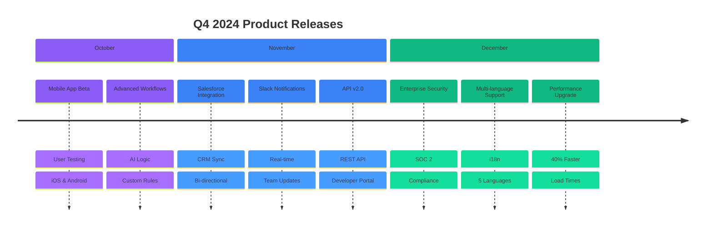
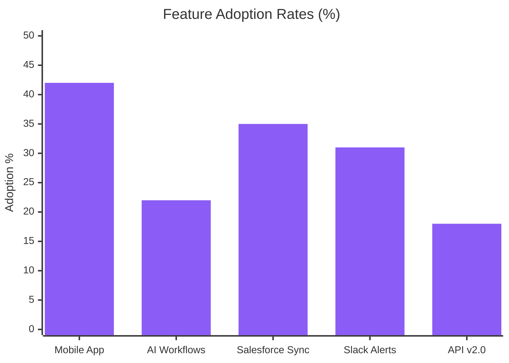
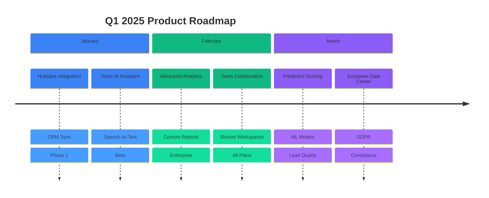

# 🚀 Product Updates

## Q4 2024 Major Releases

  <h2 className="nx-text-2xl nx-font-bold nx-mb-6 nx-text-purple-900 dark:nx-text-purple-100">🎉 Q4 Development Summary</h2>
  
  | Development Type | Count | Impact | Status |
  |------------------|-------|--------|--------|
  | **Major Features** | 8 | High Impact | Released |
  | **Feature Updates** | 23 | Medium Impact | Released |
  | **Bug Fixes** | 156 | Quality Impact | Completed |
  | **Integrations** | 5 | Business Impact | Live |

## Release Timeline

## 🎯 Major Features Released

### 1. Mobile Application (October 15)

**Native iOS & Android Apps**

  <h4 className="nx-font-semibold nx-text-blue-900 dark:nx-text-blue-100 nx-mb-2">Key Features:</h4>
  <ul className="nx-list-disc nx-list-inside nx-text-sm nx-text-blue-800 dark:nx-text-blue-200 nx-space-y-1">
    <li>Real-time notifications for sales activities</li>
    <li>Quick lead qualification on-the-go</li>
    <li>Offline mode for basic functionality</li>
    <li>Push notifications for urgent opportunities</li>
  </ul>
  

    Adoption: 42% of active users | 
    Rating: 4.7/5 (App Store) & 4.5/5 (Google Play)
  

### 2. Advanced AI Workflows (October 28)

**Intelligent Sales Automation**

  <h4 className="nx-font-semibold nx-text-purple-900 dark:nx-text-purple-100 nx-mb-2">Capabilities:</h4>
  <ul className="nx-list-disc nx-list-inside nx-text-sm nx-text-purple-800 dark:nx-text-purple-200 nx-space-y-1">
    <li>Multi-step conditional logic for lead nurturing</li>
    <li>Dynamic content personalization based on prospect behavior</li>
    <li>Automatic A/B testing for email sequences</li>
    <li>Smart escalation rules for high-value opportunities</li>
  </ul>
  

    Impact: 35% improvement in conversion rates | 
    Adoption: 22% of customers
  

### 3. Salesforce Integration (November 12)

**Bi-directional CRM Sync**

  <h4 className="nx-font-semibold nx-text-green-900 dark:nx-text-green-100 nx-mb-2">Features:</h4>
  <ul className="nx-list-disc nx-list-inside nx-text-sm nx-text-green-800 dark:nx-text-green-200 nx-space-y-1">
    <li>Real-time sync of leads, contacts, and opportunities</li>
    <li>Automatic creation of Salesforce records from AI interactions</li>
    <li>Custom field mapping and data validation</li>
    <li>Advanced reporting combining both platforms</li>
  </ul>
  

    Usage: 68% of Enterprise customers | 
    Data Sync: 99.8% accuracy
  

## 📊 Feature Adoption Metrics

### New Feature Performance

### Customer Feedback Scores

| Feature | User Rating | Feedback Volume | Top Request |
|---------|-------------|-----------------|-------------|
| **Mobile App** | 4.6/5 | 342 reviews | Tablet optimization |
| **AI Workflows** | 4.4/5 | 156 reviews | More templates |
| **Salesforce Sync** | 4.8/5 | 89 reviews | HubSpot integration |
| **Slack Integration** | 4.3/5 | 78 reviews | Teams support |
| **API v2.0** | 4.7/5 | 45 reviews | More endpoints |

## 🔧 Technical Improvements

### Performance Enhancements

#### Speed Improvements

| Metric | Improvement | Impact |
|--------|-------------|--------|
| **API Response Time** | -40% | Faster user experience |
| **Dashboard Load Time** | -35% | Reduced wait times |
| **Report Generation** | -60% | Improved productivity |
| **Mobile App Startup** | -28% | Better mobile experience |

#### Reliability Metrics

| Metric | Achievement | Target |
|--------|-------------|--------|
| **System Uptime** | 99.95% | >99.9% |
| **API Success Rate** | 99.92% | >99.5% |
| **Data Sync Accuracy** | 99.8% | >99.5% |
| **Zero-Downtime Deploys** | 47/47 | 100% success |

## 🛣️ Q1 2025 Roadmap

### Planned Major Features

### Development Priorities

1. **HubSpot Integration** (Jan 2025)
   - Complete CRM ecosystem coverage
   - Estimated impact: +25% Enterprise adoption

2. **Voice AI Assistant** (Jan 2025)
   - Hands-free operation for mobile users
   - Target: 30% mobile user adoption

3. **Advanced Analytics** (Feb 2025)
   - Custom reporting and dashboards
   - Enterprise feature for better retention

4. **Predictive Lead Scoring** (Mar 2025)
   - ML-powered lead quality prediction
   - Expected: 20% improvement in conversion

## 📈 Product Metrics Impact

### Before/After Comparison

| Metric | Pre-Q4 | Post-Q4 | Improvement |
|--------|---------|---------|-------------|
| **User Engagement** | 68% | 78% | +10pp |
| **Feature Utilization** | 45% | 62% | +17pp |
| **Customer Satisfaction** | 4.2/5 | 4.6/5 | +9.5% |
| **Support Tickets** | 1,850/month | 1,250/month | -32% |
| **Time to Value** | 14 days | 8 days | -43% |

---

*Last updated: December 15, 2024 | Next update: March 15, 2025*