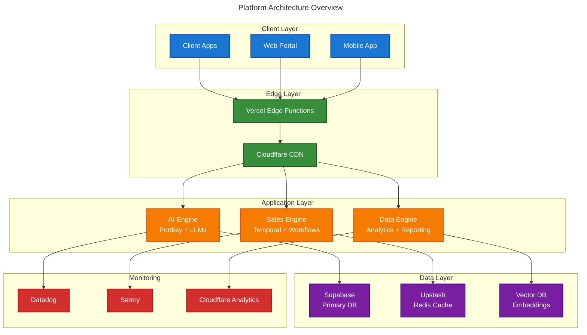
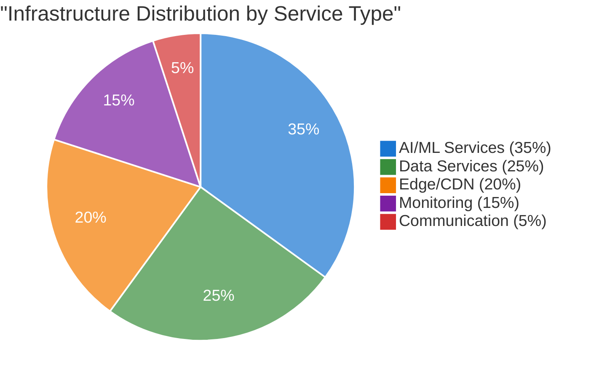
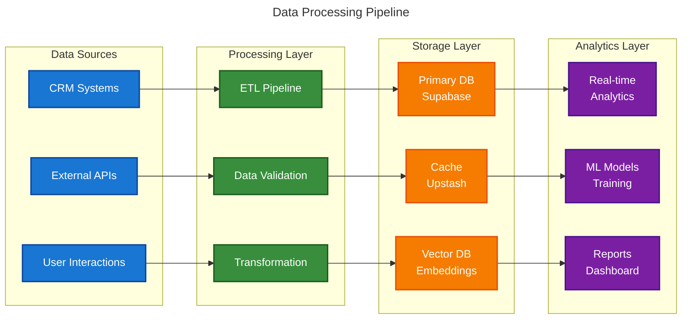
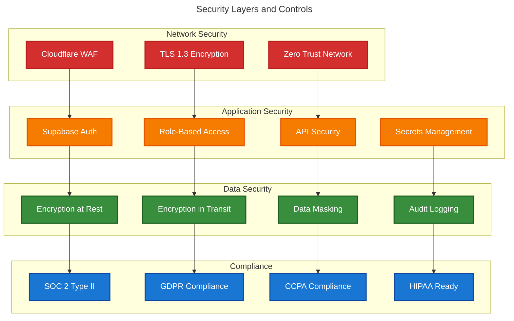
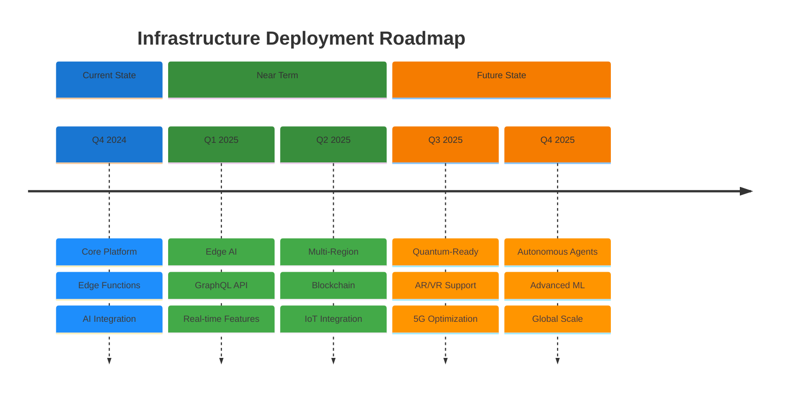
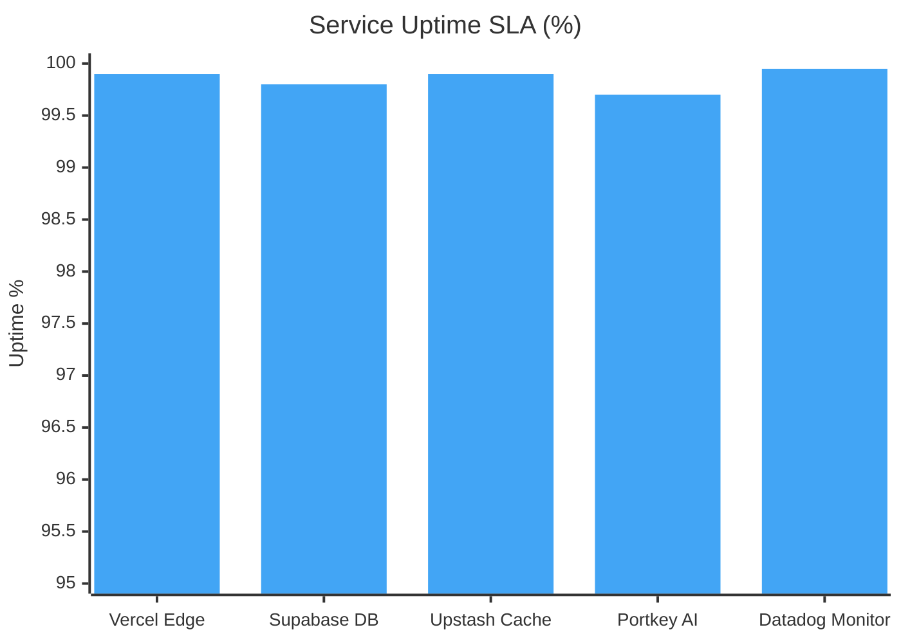

# Technical Architecture

## System Overview

Market Fit's platform is built on a modern, cloud-native architecture designed for scale, reliability, and performance. Our distributed system handles millions of sales interactions while maintaining sub-second response times.

## High-Level Architecture

 

## Technology Stack Distribution

 

 

## Data Flow Architecture

 

 

## Security Architecture

 

 

## Deployment Timeline

 

 

## Service Reliability Metrics

 

 

## Core Components

### Edge Functions (Vercel)
**Serverless Edge Computing**
- Global edge network deployment
- Serverless functions for API endpoints
- Static and dynamic content delivery
- Automatic scaling and optimization

**Technology Stack:**
- Vercel Edge Functions
- Next.js for web applications
- Cloudflare for CDN and security
- Edge caching and optimization

### AI Engine
**LLM Infrastructure with Portkey**

#### LLM Management
- **Model Orchestration**: Portkey for LLM observability and management
- **Prompt Engineering**: Version control and testing
- **Cost Optimization**: Usage tracking and optimization
- **Performance Monitoring**: Latency and quality metrics

#### Machine Learning Models
- **Lead Scoring**: Predictive models for prospect qualification
- **Personalization**: Recommendation engines for messaging
- **Conversation Flow**: Decision trees for dialogue management
- **Performance Optimization**: Reinforcement learning for improvement

**Technology Stack:**
- Portkey for LLM management
- Python with modern ML frameworks
- Vector databases for embeddings
- Vercel Edge Functions for inference

### Sales Engine
**Business Logic and Automation**

#### Workflow Management
- **Campaign Orchestration**: Multi-channel outreach sequences
- **Lead Routing**: Intelligent assignment to sales reps
- **Follow-up Automation**: Scheduled and triggered communications
- **Escalation Handling**: Human handoff protocols

#### CRM Integration
- **Data Synchronization**: Real-time bidirectional sync
- **Field Mapping**: Flexible data transformation
- **Webhook Processing**: Event-driven updates
- **Conflict Resolution**: Automated data reconciliation

**Technology Stack:**
- Temporal for workflow orchestration
- Node.js with Express framework
- Upstash for caching and queues
- Vercel Serverless Functions

### Data Engine
**Analytics and Intelligence**

#### Real-Time Analytics
- **Performance Dashboards**: Live metrics and KPIs
- **Conversion Tracking**: Funnel analysis and attribution
- **A/B Testing**: Experiment management and results
- **Predictive Forecasting**: Revenue and pipeline predictions

#### Data Processing
- **ETL Pipelines**: Extract, transform, load operations
- **Data Validation**: Quality checks and cleansing
- **Aggregation**: Summary statistics and reporting
- **Export/Import**: Data portability and backups

**Technology Stack:**
- Supabase for real-time analytics
- ClickHouse for analytics database
- Temporal for workflow orchestration
- Grafana for visualization

## Data Architecture

### Primary Database
**Supabase**
- Real-time subscriptions
- Row Level Security
- Automated backups and point-in-time recovery
- Connection pooling and query optimization
- Horizontal scaling with read replicas

### Caching Layer
**Upstash Redis**
- Serverless Redis implementation
- Session storage and user state
- Frequently accessed data caching
- Real-time leaderboards and counters
- Pub/sub for real-time notifications

### Vector Database
**Supabase Vector**
- Semantic search capabilities
- Embedding storage for AI models
- Similarity matching for personalization
- Fast retrieval for recommendation engines

### Data Warehouse
**Supabase Analytics**
- Historical data storage and analysis
- Complex analytical queries
- Data science and ML training
- Business intelligence reporting

## Security Architecture

### Network Security
- **Cloudflare Protection**: DDoS mitigation and WAF
- **Vercel Edge Security**: Global security network
- **SSL/TLS Encryption**: End-to-end encryption
- **Zero Trust Architecture**: Never trust, always verify

### Application Security
- **Supabase Auth**: Built-in authentication
- **Role-Based Access Control**: Granular permissions
- **API Security**: Rate limiting and input validation
- **Secrets Management**: Encrypted credential storage

### Data Security
- **Encryption at Rest**: Database encryption
- **Encryption in Transit**: TLS 1.3 for all communications
- **Data Masking**: PII protection in non-production environments
- **Audit Logging**: Comprehensive access and change tracking

### Compliance
- **SOC 2 Type II**: Security and availability controls
- **GDPR Compliance**: Data privacy and user rights
- **CCPA Compliance**: California consumer privacy
- **HIPAA Ready**: Healthcare data protection capabilities

## Scalability & Performance

### Horizontal Scaling
- **Serverless Architecture**: Automatic scaling
- **Edge Computing**: Global distribution
- **Load Balancing**: Traffic distribution
- **Database Sharding**: Horizontal data partitioning

### Performance Optimization
- **Vercel Edge Network**: Global content delivery
- **Upstash Caching**: Multi-level caching implementation
- **Query Optimization**: Database performance tuning
- **Async Processing**: Non-blocking operations

### Monitoring & Observability
- **Datadog**: Application monitoring and metrics
- **Sentry**: Error tracking and performance monitoring
- **Portkey**: LLM observability
- **Cloudflare Analytics**: Edge performance metrics

## Deployment & DevOps

### Infrastructure as Code
- **Vercel**: Platform deployment
- **Supabase**: Database and authentication
- **Temporal**: Workflow orchestration
- **GitOps**: Git-based deployment workflows

### CI/CD Pipeline
- **Vercel**: Automated testing and deployment
- **GitHub Actions**: CI/CD automation
- **Docker**: Containerized applications
- **Cloudflare**: Edge deployment

### Environment Management
- **Development**: Local and preview deployments
- **Staging**: Production-like testing environment
- **Production**: High-availability production deployment
- **Disaster Recovery**: Multi-region backup and failover

## Integration Architecture

### CRM Integrations
- **Salesforce**: Native API integration
- **HubSpot**: Real-time data synchronization
- **Pipedrive**: Bidirectional data flow
- **Custom CRMs**: Flexible API adapters

### Communication Channels
- **Email**: SMTP and API-based sending
- **LinkedIn**: Social selling automation
- **Phone**: VoIP and SMS integration
- **Slack/Teams**: Internal notifications

### Third-Party Services
- **Data Providers**: Lead enrichment services
- **Analytics**: Datadog, Sentry
- **Payment Processing**: Stripe, PayPal
- **Support**: Zendesk, Intercom

## Vendor Contracts & Infrastructure

### Core Infrastructure
| Service | Provider | Purpose | Contract Term |
|---------|----------|---------|---------------|
| Edge Computing | Vercel | Application hosting and edge functions | Annual |
| Database | Supabase | Primary database and authentication | Annual |
| Vector Database | Supabase | AI embeddings and semantic search | Annual |
| Caching | Upstash | Redis caching and queues | Annual |
| Workflow Engine | Temporal | Business process orchestration | Annual |

### AI & ML Infrastructure
| Service | Provider | Purpose | Contract Term |
|---------|----------|---------|---------------|
| LLM Management | Portkey | AI model orchestration and monitoring | Annual |
| Vector Storage | Supabase | Embedding storage and retrieval | Annual |
| Model Training | Vercel | Edge AI model deployment | Annual |
| AI Analytics | Portkey | LLM performance monitoring | Annual |
| LLM Hosting | Azure OpenAI | Primary LLM provider | Annual |
| LLM Hosting | AWS Bedrock | Secondary LLM provider | Annual |
| LLM Hosting | Google Vertex AI | Tertiary LLM provider | Annual |

### Communication Infrastructure
| Service | Provider | Purpose | Contract Term |
|---------|----------|---------|---------------|
| Messaging | Twilio | SMS and email delivery | Annual |
| Authentication | Composio | Identity and access management | Annual |
| CDN & Security | Cloudflare | DDoS protection and edge security | Annual |

### Security & Monitoring
| Service | Provider | Purpose | Contract Term |
|---------|----------|---------|---------------|
| CDN & Security | Cloudflare | DDoS protection and edge security | Annual |
| Monitoring | Datadog | Application performance monitoring | Annual |
| Error Tracking | Sentry | Error monitoring and debugging | Annual |
| Analytics | Cloudflare | Edge performance metrics | Annual |

### Key Terms
- **Service Level Agreements**: 99.9% uptime guarantee
- **Data Processing**: GDPR and CCPA compliant
- **Security Standards**: SOC 2 Type II compliance
- **Support Level**: 24/7 technical support
- **Renewal Terms**: Annual review with 30-day notice
- **Data Retention**: Configurable retention periods
- **Backup Policy**: Daily automated backups
- **Disaster Recovery**: Multi-region failover capability

## Future Architecture Roadmap

### Q1 2025
- **Edge AI**: Deploy ML models at the edge
- **GraphQL API**: More efficient data fetching
- **Real-time Collaboration**: WebSocket-based features
- **Advanced LLM**: Improved model orchestration

### Q2 2025
- **Multi-Region**: Global deployment for reduced latency
- **Blockchain**: Immutable audit trails
- **IoT Integration**: Connect with smart devices
- **Voice AI**: Natural language voice interactions

### Q3 2025
- **Quantum-Ready**: Prepare for quantum computing
- **AR/VR**: Immersive sales experiences
- **5G Optimization**: Leverage high-speed mobile networks
- **Autonomous Agents**: Self-improving AI systems 