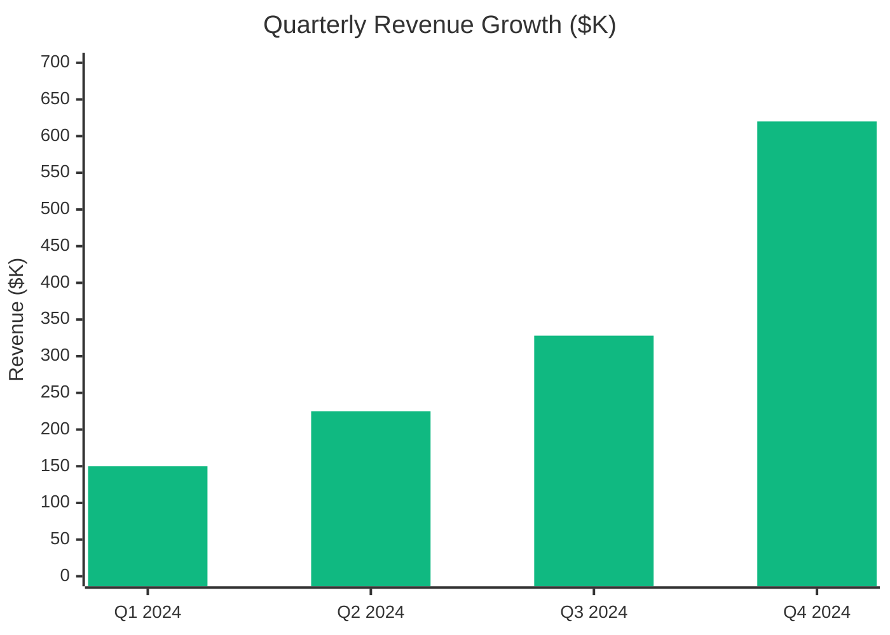
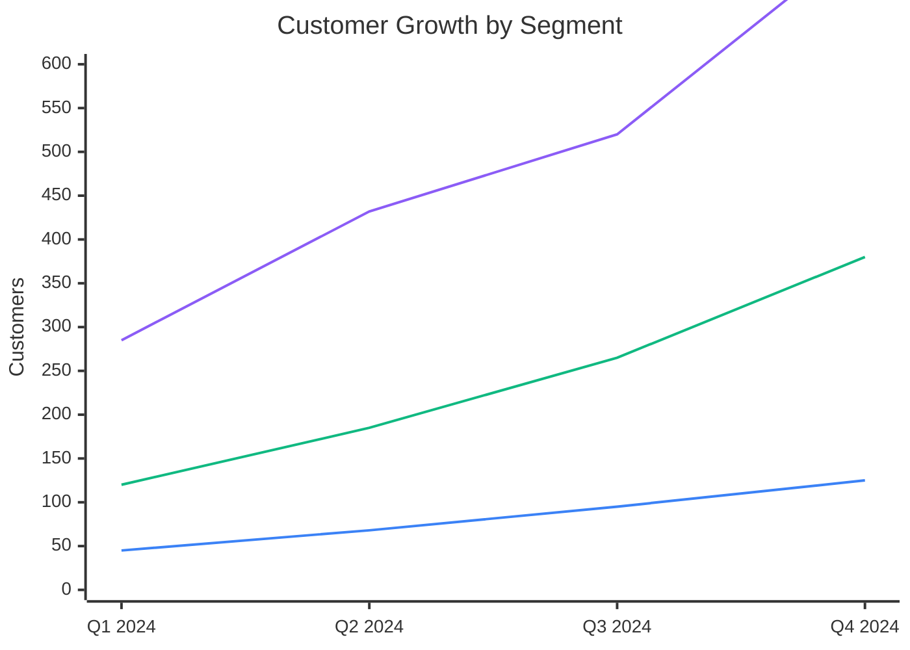
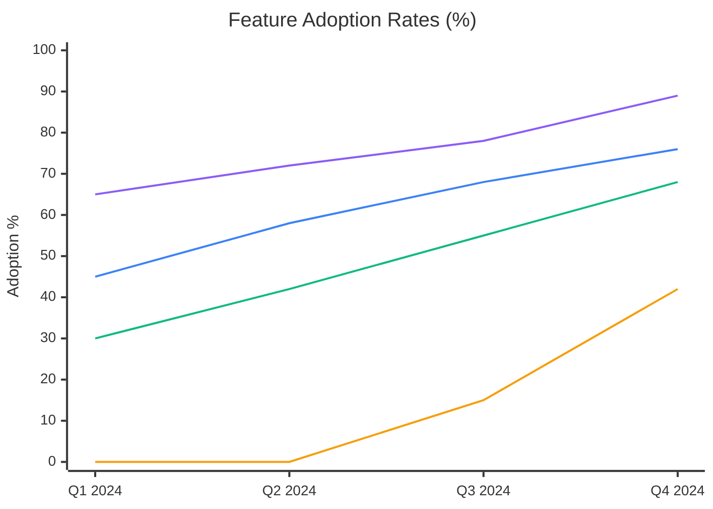

# 📊 Quarterly Comparison

## Quarter-over-Quarter Analysis

  <h2 className="nx-text-2xl nx-font-bold nx-mb-6 nx-text-indigo-900 dark:nx-text-indigo-100">📈 Q4 vs Q3 2024 Performance</h2>
  
  | Metric | Q3 2024 | Q4 2024 | QoQ Change | Trend |
  |--------|---------|---------|-----------|-------|
  | **Quarterly Revenue** | $328K | $620K | +85% | 📈 |
  | **Active Customers** | 880 | 1,250 | +42% | 📈 |
  | **Monthly Active Users** | 12.1K | 15.5K | +28% | 📈 |
  | **Customer Acquisition Cost** | $225 | $190 | -15% | 📉 |

## Revenue Performance

### Quarterly Revenue Comparison

### Revenue Growth Rate Trends

| Quarter | Revenue | QoQ Growth | QoQ Growth Rate |
|---------|---------|------------|-----------------|
| **Q1 2024** | $150K | - | - |
| **Q2 2024** | $225K | +$75K | +50% |
| **Q3 2024** | $328K | +$103K | +46% |
| **Q4 2024** | $620K | +$292K | +89% |

## Customer Metrics Evolution

### Customer Count by Quarter

### Customer Acquisition Metrics

| Metric | Q1 2024 | Q2 2024 | Q3 2024 | Q4 2024 | Trend |
|--------|---------|---------|---------|---------|-------|
| **New Customers** | 450 | 235 | 195 | 370 | 📈 |
| **Churn Rate** | 5.2% | 4.1% | 3.3% | 2.8% | 📉 |
| **Net Adds** | 450 | 162 | 125 | 268 | 📈 |
| **Total Customers** | 450 | 685 | 880 | 1,250 | 📈 |

## Operational Efficiency

### Unit Economics Progression

#### Customer Acquisition Cost (CAC)

| Quarter | CAC | Quarterly Change | Annual Trend |
|---------|-----|------------------|--------------|
| **Q1 2024** | $12,500 | - | Baseline |
| **Q2 2024** | $11,200 | -10.4% | Improving |
| **Q3 2024** | $10,000 | -10.7% | Consistent decline |
| **Q4 2024** | $8,500 | -15.0% | **-32% improvement YoY** |

#### LTV:CAC Ratio

| Quarter | Ratio | Performance | Target Achievement |
|---------|-------|-------------|-------------------|
| **Q1 2024** | 3.2x | Good | ✅ Above 3x target |
| **Q2 2024** | 3.8x | Strong | ✅ Above 3x target |
| **Q3 2024** | 4.5x | Excellent | ✅ Above 3x target |
| **Q4 2024** | 5.3x | Outstanding | **✅ Target: 3x+ Achieved** |

## Product Adoption Trends

### Feature Usage Evolution

### Quarter Performance Summary

| Metric | Q1 2024 | Q2 2024 | Q3 2024 | Q4 2024 | Best Quarter |
|--------|---------|---------|---------|---------|--------------|
| **Revenue Growth** | - | 50% | 46% | 89% | Q4 2024 🏆 |
| **Customer Growth** | - | 52% | 28% | 42% | Q2 2024 |
| **Gross Margin** | 78% | 81% | 84% | 86% | Q4 2024 🏆 |
| **NPS Score** | 52 | 58 | 62 | 67 | Q4 2024 🏆 |
| **Churn Rate** | 5.2% | 4.1% | 3.3% | 2.8% | Q4 2024 🏆 |

## Year-over-Year (YoY) Comparison

### 2024 vs 2023 Key Metrics

  <h3 className="nx-text-lg nx-font-semibold nx-mb-4 nx-text-gray-900 dark:nx-text-gray-100">🎯 2024 Annual Performance</h3>
  
  

    

      
$1.32M

      
Total 2024 Revenue

      
+425% vs 2023

    

    

      
1,250

      
End-of-Year Customers

      
+315% vs 2023

    

    

      
$2.4M

      
Current ARR

      
+320% vs 2023

    

  

## Looking Ahead: Q1 2025 Projections

### Projected Growth Trajectories

| Metric | Q4 2024 (Actual) | Q1 2025 (Projected) | Expected Growth |
|--------|-------------------|----------------------|-----------------|
| **Revenue** | $620K | $850K | +37% QoQ |
| **ARR** | $2.4M | $3.2M | +33% QoQ |
| **Customers** | 1,250 | 1,580 | +26% QoQ |
| **MAU** | 15,500 | 18,500 | +19% QoQ |
| **Gross Margin** | 86% | 88% | +2pp |

### Strategic Initiatives Impact

#### Q1 2025 Focus Areas

##### HubSpot Integration
Expected +15% growth in mid-market segment

##### Voice AI Assistant  
Target 30% mobile adoption rate

##### European Expansion
New data center + GDPR compliance implementation

##### Advanced Analytics
Enterprise customer retention improvement

---

*Last updated: December 15, 2024 | Next update: March 15, 2025*