# Organization Chart

## Current Organizational Structure

Our organization follows an AI-First structure with human leadership directing specialized AI teammates. We have 2 human leaders overseeing 7+ AI teammates that handle all operational functions.

```mermaid
---
title: "Market Fit - Organizational Structure"
---
graph TD
    subgraph "👥 Human Leadership"
        CEO[Sergio Prado<br/>CEO & CTO]
        COO[Alejandra Barragán<br/>COO]
    end
    
    subgraph "🤖 AI Team Lead"
        GL[Growth Lead AI<br/>Team Coordinator]
    end
    
    subgraph "🤖 AI Deputy"
        DA[Data Analyst AI<br/>Analytics Lead]
    end
    
    subgraph "🤖 AI Specialists"
        GM[Growth Marketer AI]
        UX[UX Designer AI]
        SS[Sales Specialist AI]
        CS[Customer Support AI]
        CC[Content Creator AI]
    end
    
    CEO --> GL
    COO --> GL
    GL --> DA
    DA --> GM
    DA --> UX
    DA --> SS
    DA --> CS
    DA --> CC
    
    style CEO fill:#1976d2,stroke:#fff,stroke-width:3px,color:#fff
    style COO fill:#388e3c,stroke:#fff,stroke-width:3px,color:#fff
    style GL fill:#f57c00,stroke:#fff,stroke-width:3px,color:#fff
    style DA fill:#7b1fa2,stroke:#fff,stroke-width:3px,color:#fff
    style GM fill:#d32f2f,stroke:#fff,stroke-width:2px,color:#fff
    style UX fill:#d32f2f,stroke:#fff,stroke-width:2px,color:#fff
    style SS fill:#d32f2f,stroke:#fff,stroke-width:2px,color:#fff
    style CS fill:#d32f2f,stroke:#fff,stroke-width:2px,color:#fff
    style CC fill:#d32f2f,stroke:#fff,stroke-width:2px,color:#fff
```

 

 

## Team Composition

 

 

## AI Teammates Specialization

```mermaid
---
title: "AI Team Hierarchy"
---
graph TB
    A1[Growth Lead AI<br/>🎯 Strategy]
    
    A2[Data Analyst AI<br/>📊 Analytics Lead]
    
    B1[Growth Marketer AI<br/>📢 Marketing]
    B2[UX Designer AI<br/>🎨 Design]
    C1[Sales Specialist AI<br/>💼 Sales]
    C2[Customer Support AI<br/>📞 Support] 
    D1[Content Creator AI<br/>✍️ Content]
    
    A1 --> A2
    A2 --> B1
    A2 --> B2
    A2 --> C1
    A2 --> C2
    A2 --> D1
    
    style A1 fill:#f57c00,stroke:#fff,stroke-width:3px,color:#fff
    style A2 fill:#7b1fa2,stroke:#fff,stroke-width:3px,color:#fff
    style B1 fill:#388e3c,stroke:#fff,stroke-width:2px,color:#fff
    style B2 fill:#1976d2,stroke:#fff,stroke-width:2px,color:#fff
    style C1 fill:#d32f2f,stroke:#fff,stroke-width:2px,color:#fff
    style C2 fill:#00796b,stroke:#fff,stroke-width:2px,color:#fff
    style D1 fill:#ff5722,stroke:#fff,stroke-width:2px,color:#fff
```

 

 

## Human Leadership Team

### Sergio Prado - CEO & CTO & Co-Founder
- **Experience**: 20+ years, 91+ projects
- **Focus**: AI-driven business solutions, technology & UX
- **Role**: Vision, strategy, technology leadership, AI team oversight

### Alejandra Barragán - COO & Co-Founder  
- **Experience**: 11+ years scaling startups
- **Focus**: AI operations & data-driven decisions
- **Role**: Operations, growth, AI coordination

## AI Teammates Capabilities

### 🤖 Growth Lead AI
- Strategy development & execution
- Team coordination & performance
- A/B testing & experimentation

### 🤖 Data Analyst AI
- Analytics & insights generation
- Lead qualification & scoring
- Performance tracking & reporting

### 🤖 Growth Marketer AI
- Multi-channel marketing campaigns
- Growth hacking experiments
- Lead generation optimization

### 🤖 UX Designer AI
- User experience optimization
- UI/UX design & improvements
- Conversion rate optimization

### 🤖 Sales Specialist AI
- LinkedIn & outbound sales
- CRM management & optimization
- Lead nurturing & follow-up

### 🤖 Customer Support AI
- Customer success & support
- Knowledge base management
- Issue resolution & feedback

### 🤖 Content Creator AI
- Content creation & copywriting
- Blog & social media management
- Brand voice & messaging

## AI Performance Metrics

| AI Teammate | Primary Function | Availability | Performance |
|-------------|------------------|--------------|-------------|
| **Growth Lead AI** | Strategy & coordination | 24/7 | 100% consistency |
| **Data Analyst AI** | Analytics & qualification | 24/7 | 98.5% accuracy |
| **Growth Marketer AI** | Campaigns & outreach | 24/7 | 96% relevance |
| **UX Designer AI** | Design & optimization | 24/7 | 95% user satisfaction |
| **Sales Specialist AI** | CRM & lead nurturing | 24/7 | 94% precision |
| **Customer Support AI** | Support & success | 24/7 | 97% resolution rate |
| **Content Creator AI** | Content & social media | 24/7 | 93% engagement rate |

## Team Stats

  

    
2

    
Human Leadership

  

  

    
7

    
AI Teammates

  

  

    
24/7

    
Availability

  

  

    
2,500+

    
Virtual Processes

  

## Growth Plan

### Q1 2025 AI Expansion
- **Advanced Analytics AI**: Enhanced ML insights
- **Content Strategy AI**: Advanced content automation  
- **Customer Success AI**: Post-sale relationship management
- **Partnership AI**: Channel partnership automation

### Q2 2025 AI Scaling
- **AI Coordinator**: Advanced AI team management
- **Product Development AI**: Enhanced product capabilities
- **Quality Assurance AI**: Automated testing & optimization
- **Performance Optimization AI**: System-wide efficiency

  <h3 className="nx-text-lg nx-font-semibold nx-mb-2">AI-First Organization</h3>
  
    Our structure combines human strategic leadership with AI operational excellence. With just 2 human leaders overseeing 7+ specialized AI teammates, we achieve maximum efficiency and 24/7 operational capacity.
  

 